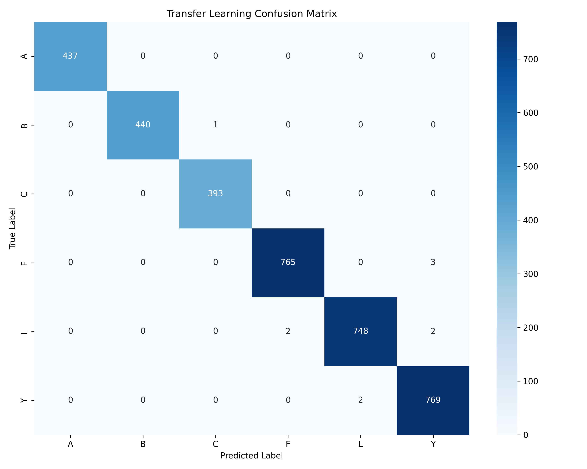
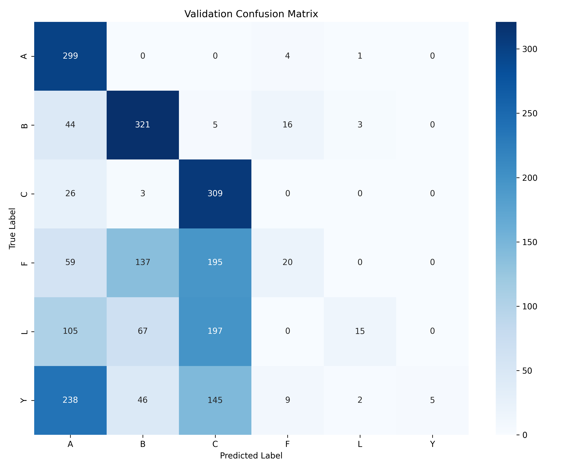
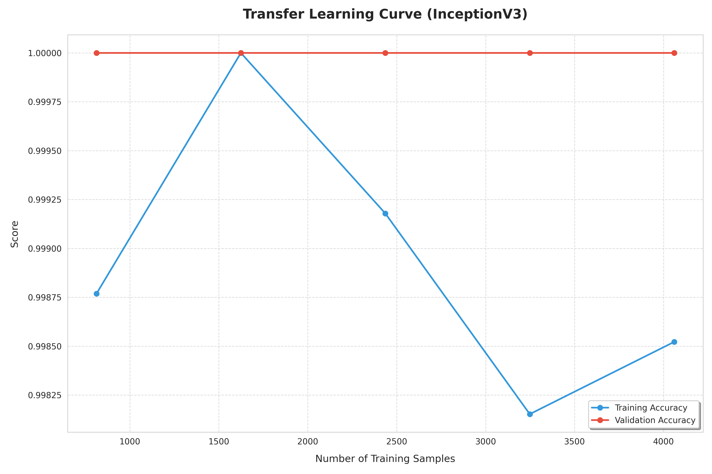
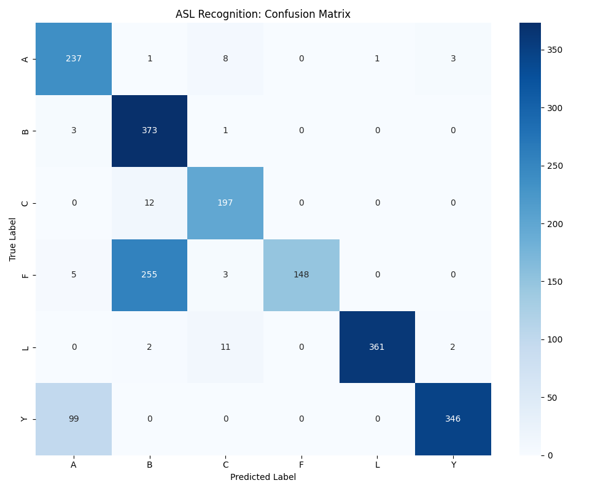
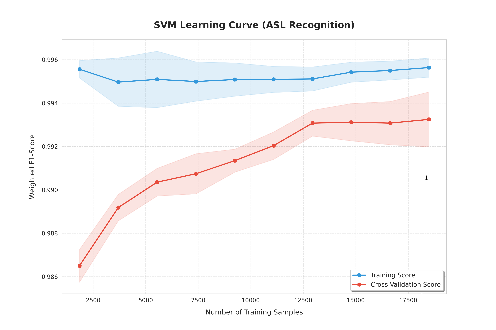

# Deliverable 2

#Phase 1: Transfer Learning

## Data processing methodology

In Phase 1, the adopted strategy was transfer learning with the support of InceptionV3 and MediaPipe.

The processing pipeline was as follows:

1. The original images are stored in `src/Data/collected`.
2. MediaPipe is used to detect hands and extract the valid images.
3. The detected bounding box is used to crop only the hand region.
4. Each valid crop is resized to `299x299`, which is compatible with the InceptionV3 backbone.
5. The processed images are stored in `src/Data/processed`.
6. The processed dataset is then split into:

-`80%` for the development set (`src/Data/split/train`)

-`20%` for the test set (`src/Data/split/test`)

7. Validation is derived randomly from test data consisting of `20%` of the total training data.

In addition to dataset preparation, a data augmentation pipeline was introduced and applied only to the training set, including brightness, contrast, saturation, zoom, and small translations. Horizontal flip was not used because in sign language the orientation of the hand may alter the meaning of the gesture.

## Explored models and justification for their selection

The main model explored in this phase was a transfer learning classifier with `InceptionV3`, using ImageNet-pretrained weights and removing the original classification head. On top of the backbone, the layers `GlobalAveragePooling2D`, `Dense(256)`, `Dropout(0.3)`, and a final `Dense(n_classes, activation="softmax")` layer were added.

The choice of transfer learning with InceptionV3 was motivated by four main reasons:

- Our professor suggested it :D
- The problem is visual and benefits from representations already learned on large image datasets.
- InceptionV3 naturally operates with `299x299`, which fits well with the cropped-image pipeline.
- The use of a pretrained backbone makes it possible to obtain a strong baseline with less training time and lower risk of instability.

Two training phases were explored:

- Initial training with the backbone frozen, in order to learn only the classifier head.
- Fine-tuning the last `30` layers of InceptionV3 with a lower learning rate, in order to better adapt the features to hand geometry.

During this phase, learning curves were also analysed to assess whether more data was improving generalisation. The results showed that the dataset is, in general, highly learnable, but that smaller subsets appear to be less representative of the full variability, which justifies using the largest possible number of processed samples.

### Confusion matrixes and their revelations

- Using data to validate from the dataset itself we obtain this matix

- Althought this seems strong when validating with images taken by us this is the result:

- Here it shows that the classes A, B and C are still very consistent while the rest is very inconsistent, which could be because of the fact they derive from different datasets (A,B,C are from one dataset and Y,L,F are from another). We are working on figuring how the fix for these issues.

### Insights into our changes

- Changed the split from 70/20/10 train/test/val to 80/20 train/test and used random 20% from train to validate after observing weird behaviour from the learning curves - A,B,C dataset

- After the change the problem seem to persist

- We felt we might have needed to add some more classes for the curve to be evident. Previous models were tested with A,B and C which are very different. Adding Y and F might make it more evident as B is very close to F and A is fairly similar to Y and L fairly similar to C.

- As shown in this graph the problem was the vast difference between classes, as when there was slight changes within different classes the curve became the expected result. There appears to be no overfitting with large quantities of training data. In smaller quantities of data the dataset does have some overfitting problems probably due to the lack of generalization
- In conclusion, the current three-class setup (A, B, C) may simply be too easy to reveal overfitting or data-scaling effects clearly as they are too different. We are still working on figuring out wether this is a valid concern or something that isnt necessarily a problem.

# Phase 2: SVM

Following our transfer learning implementations, we now move into phase 2, focusing on training a linear SVM model with our ASL data as suggested by the professor.

## Data Processing and Model Training Methodology

### 1. Feature Extraction (MediaPipe Hand Landmarks)

Instead of processing images, our SVM model operates on **geometric hand landmarks** extracted via MediaPipe. This significantly reduces the input dimensionality while preserving essential spatial information. The features stored in `handmarks.csv` include:

- **Normalized Distances:** Relative distances between finger tips and key joints.
- **Finger Curls:** Quantified degree of finger flexion.
- **Hand Orientation:** Palm rotation and tilt relative to the wrist.
- **Spatial Variance:** Variability in Y-coordinates to differentiate between open and closed hand states.

### 2. Hand Size Normalization (Geometric Scaling)

To ensure the model is **scale-invariant**, we normalize coordinates during the extraction phase. This allows the system to recognize signs correctly regardless of whether the user is close to or far from the camera.

- **Reference Vector:** We use the distance between **Landmark 1 (Thumb CMC)** and **Landmark 13 (Ring finger MCP)** as the baseline "hand scale." This span is chosen for its relative stability across different hand gestures.
- **Coordinate Translation:** All landmarks are translated relative to the **Wrist (Landmark 0)**, which becomes the origin (0,0).
- **Unit Scaling:** Every raw pixel coordinate is divided by the reference hand scale, converting distances into "hand-relative units."
- **Validation:** Frames where the hand is too small (<5% of image) or too large (>80% of image) are automatically discarded to maintain data integrity.

### 3. Data Preparation and Stratification

To ensure the model learns correctly across all classes:

- **Stratified Split:** Data is divided into Training (80%) and Validation (20%) using stratification to maintain class proportions.
- **Class Balancing:** We use `class_weight='balanced'` in the SVM configuration to handle any class distribution skews.

### 4. Preprocessing: Feature Scaling

Since SVM is a distance-based algorithm, **Feature Scaling** is mandatory. We employ `StandardScaler` to normalize the data (mean=0, variance=1). This prevents features with larger numerical ranges from disproportionately influencing the model's decision boundaries.

### 5. Hyperparameter Optimization (Grid Search & CV)

To identify the optimal configuration for the RBF kernel, we use **GridSearchCV** integrated with **5-fold Cross-Validation**. This rigorous process ensures that our chosen parameters are not just "lucky" for one specific data split.

- **The 5-Fold Process:** The training data is divided into five equal subsets. The model is trained and validated five times; in each iteration, a different fold serves as the validation set while the remaining four are used for training. The final score for a parameter combination is the average of these five runs.
- **Preventing Overfitting:** By validating across the entire training set, we minimize the risk of overfitting to noise in any single subset, leading to a model that generalizes better to new users.
- **Weighted Scoring:** We optimize for `f1_weighted` during the search. This ensures that the grid search prioritizes parameters that achieve high precision and recall across all ASL letters, rather than just maximizing raw accuracy.

The search explores different combinations of:

- **C (Regularization):** Controls the trade-off between decision boundary smoothness and correct classification of training points.
- **Gamma:** Defines how far the influence of a single training example reaches.

### 6. Evaluation with Robust Metrics

Performance is not measured by raw accuracy alone:

- **Balanced Accuracy:** The average recall of all classes, providing a fair assessment even with minor imbalances.
- **Macro F1-Score:** The harmonic mean of precision and recall, averaged across all labels to ensure high performance on every letter.
- **Confusion Matrix Analysis:** Used specifically to identify common misclassifications

Our first attempt at training the model was quite successful, our accuracy was around 99% and our F1-score was around 99% too. We computed the learning curves and because they seem pretty optimistic we decided to try and add a few more classes.

Here we found a slight problem as our accuracy kept 96 plus percentage and our confusion matrix showed the model was suposedly correctly classifying all classes, but when testing with live images B and C signs were often confused with F. This led us to believe that the model was overfitting to our training data and that the validation data was not diverse and different enough from our training data.

While troubleshooting we found that the new classes lead to a much more imbalanced dataset, as the new classes had way more samples than the older ones, so we started by rebalancinging it. This slightly improved the model, so we then tried to use a weighted SVM to account for the class imbalance.

In the live tests the model started to perform better but it was still confusing B with F, and, that was still not represented in the confusion matrix.
So we decided to take a collection of live taken images and use them as our validation set. This was a much better approach the faults of the model were
now finally evident in the confusion matrix and other metrics.

Given the results we thankfully found the F and B misclassifications were due to the fact that when we were extracting the distances from the dataset we were mistakenly discarting some of the distances relating the point of the index finger from the point of the thumb, which is where the main difference between the two signs lies.

We retrained our model and v3 showed very nice results with an F1-score of around 93% and an accuracy of around 95%, the confusion matrix which he had much more faith in showed was indeed correclty classifying all present signs, although there were still some misclassifications.

Happy with the results we computed the learning curves to verify if our model would react well to the addition of new classes:

## Ethical considerations

- The reduced number of classes makes the problem more controlled, but also less representative of real communication scenarios.
- The use of hand images requires attention to privacy and data provenance, even when the focus is only on the gesture itself.
- A model that performs well under controlled conditions may fail in real-world contexts.

## Adjustments required relative to Deliverable 1

- The focus moved from a more initial and exploratory idea to a concrete and reproducible transfer learning pipeline.
- Instead of using raw images directly, we cropped images to fit the InceptionV3's model necesseties.
- An important normalisation issue was identified and corrected: the `Rescaling` layer had to be placed before the backbone in order to respect the input range expected by InceptionV3.
