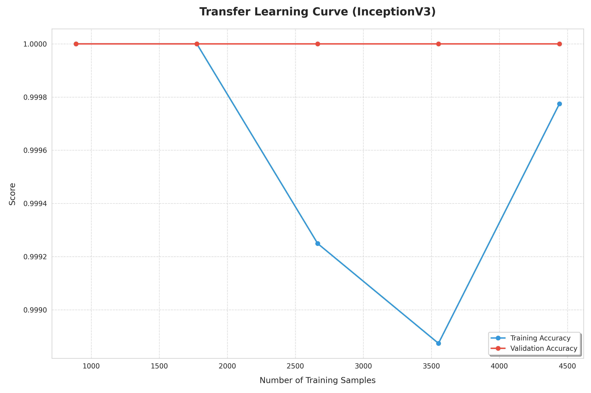
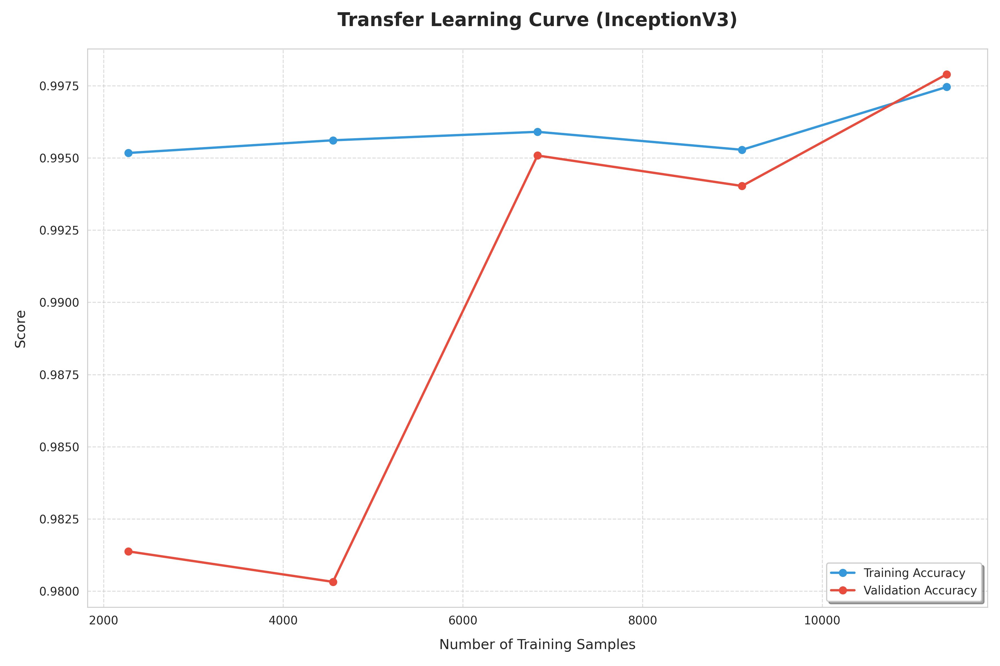

# ASL Sign Language Recognition - Model Improvement Plan

## Problem Statement

The current transfer-learning model (**training_transfer.py**) achieves only **~31% accuracy** classifying 3 ASL gestures (A, B, C) with frozen InceptionV3. The improvement guide (**impl_plan.md**) outlines several techniques. This plan turns those ideas into a concrete, ordered execution strategy against the actual codebase.

### Current State Summary

| Aspect             | Current State                                                             |
| ------------------ | ------------------------------------------------------------------------- |
| **Model**          | InceptionV3 (frozen) + GAP + Dense(128) + Dropout(0.2) + Softmax          |
| **Data**           | `Data/collected/` - 13,399 raw images (A: 4523, B: 4531, C: 4345)         |
| **Processed data** | `Data/processed/` - 9,500 hand-cropped images (A: 3253, B: 3584, C: 2663) |
| **Training data**  | `Data/training/` - 9,000 images (3000 per class, balanced)                |
| **Test data**      | `Data/testing/asl_alphabet_test/` - 3 images (1 per class)                |
| **Normalization**  | `Rescaling(1./127.5, offset=-1)` placed **after** InceptionV3 (broken)    |
| **Augmentation**   | None                                                                      |
| **Epochs**         | 10, no callbacks                                                          |
| **Fine-tuning**    | None (all InceptionV3 layers frozen)                                      |
| **Input size**     | 299x299 (correct for InceptionV3)                                         |

- Modelos explorados e justificação para a sua seleção

---

## User Review Required

IMPORTANT

**Data source decision** : The plan uses `Data/processed/` (hand-cropped via MediaPipe) as the primary training data instead of `Data/collected/` (raw webcam frames). This should result in a much better signal, since the model sees only the hand region. If you prefer to keep using `Data/collected/`, let me know.

IMPORTANT

**Class count** : The current setup only has 3 classes (A, B, C). The plan is written for this 3-class setup. If you plan to add more gesture classes later, the pipeline will scale naturally - just add more subfolders.

WARNING

**Test set is too small** : There are currently only 3 test images (1 per class). The plan includes creating a proper held-out test split. Without this, any accuracy metric is meaningless.

---

## Proposed Changes

The work is organized into 6 phases, ordered by impact and dependency.

---

### Phase 1: Fix Critical Normalization Bug

**Impact: HIGH | Effort: LOW | This alone could significantly boost accuracy.**

The current model applies `Rescaling(1./127.5, offset=-1)` **after** InceptionV3's convolutional layers. This means InceptionV3 receives raw `[0, 255]` pixel values when it was pre-trained on `[-1, 1]` normalized inputs. Every feature the frozen InceptionV3 extracts is garbage because the input distribution is completely wrong.

#### [MODIFY] **training_transfer.py**

- **Remove** the `Rescaling` layer from inside the model Sequential stack
- **Add** `tf.keras.applications.inception_v3.preprocess_input` as a preprocessing step applied to the dataset **before** feeding into the model, or add a `Rescaling` layer **before** InceptionV3 in the Sequential
- The InceptionV3 `preprocess_input` function maps `[0, 255]` -> `[-1, 1]`, which is exactly what the pretrained weights expect

<pre>

diff

<svg xmlns="http://www.w3.org/2000/svg" width="24" height="24" viewBox="0 0 24 24" fill="none" stroke="currentColor" stroke-width="2" stroke-linecap="round" stroke-linejoin="round" aria-hidden="true" class="lucide lucide-copy h-3.5 w-3.5"><rect width="14" height="14" x="8" y="8" rx="2" ry="2"></rect><path d="M4 16c-1.1 0-2-.9-2-2V4c0-1.1.9-2 2-2h10c1.1 0 2 .9 2 2"></path></svg>

model = tf.keras.Sequential([

+    tf.keras.layers.Rescaling(1./127.5, offset=-1),  # Normalize BEFORE InceptionV3

     classifier,

-    tf.keras.layers.Rescaling(1./127.5, offset=-1),

     tf.keras.layers.GlobalAveragePooling2D(),

     tf.keras.layers.Dense(128, activation='relu'),

     tf.keras.layers.Dropout(0.2),

     tf.keras.layers.Dense(n_letters, activation='softmax')

 ])

</pre>

---

### Phase 2: Switch to Processed (Hand-Cropped) Data

**Impact: HIGH | Effort: LOW**

The `Data/processed/` directory contains MediaPipe-cropped hand images (background removed, focused on the hand). Training on these gives the model a much cleaner signal vs raw webcam frames where the hand is a small region of a cluttered background.

#### [MODIFY] **training_transfer.py**

- Change the data directory from `./Data/collected` to `./Data/processed`
- Add a proper train/validation/test split strategy

<pre>

diff

<svg xmlns="http://www.w3.org/2000/svg" width="24" height="24" viewBox="0 0 24 24" fill="none" stroke="currentColor" stroke-width="2" stroke-linecap="round" stroke-linejoin="round" aria-hidden="true" class="lucide lucide-copy h-3.5 w-3.5"><rect width="14" height="14" x="8" y="8" rx="2" ry="2"></rect><path d="M4 16c-1.1 0-2-.9-2-2V4c0-1.1.9-2 2-2h10c1.1 0 2 .9 2 2"></path></svg>

train_ds = tf.keras.utils.image_dataset_from_directory(

-    "./Data/collected",

+    "./Data/processed",

     validation_split=0.2,

     subset="training",

     seed=123,

     image_size=(299, 299),

     batch_size=16

 )

</pre>

---

### Phase 3: Add Data Augmentation Pipeline

**Impact: MEDIUM-HIGH | Effort: MEDIUM**

Add on-the-fly data augmentation to the training pipeline. Augmentation is applied only to training data, not validation.

#### [MODIFY] **training_transfer.py**

Add a `tf.data` augmentation pipeline:

- **Random rotation** : +/-15 degrees (hand angle varies in real use)
- **Random brightness** : +/-20% (different lighting conditions)
- **Random contrast** : 0.8-1.2x
- **Random zoom/crop** : 0.8-1.0x then resize back to 299x299
- **No horizontal flip** : Flipping would confuse left/right hand and change letter meaning
- **Random translation** : +/-10% shift (hand position varies)

The augmentation function will be mapped onto `train_ds` using `tf.data.Dataset.map()` with `num_parallel_calls=tf.data.AUTOTUNE` and `.prefetch(tf.data.AUTOTUNE)` for pipeline optimization.

---

### Phase 4: Improve Model Architecture and Training Configuration

**Impact: MEDIUM | Effort: LOW**

#### [MODIFY] **training_transfer.py**

**Architecture changes:**

- Increase Dense layer from 128 to 256 units (more capacity for feature mapping)
- Increase Dropout from 0.2 to 0.3 (better regularization with augmented data)

**Training changes:**

- Increase epochs from 10 to 30
- Add `EarlyStopping` callback (monitor `val_loss`, patience=5, `restore_best_weights=True`)
- Add `ReduceLROnPlateau` callback (monitor `val_loss`, factor=0.5, patience=3, min_lr=1e-7)
- Add `ModelCheckpoint` callback to save the best model during training

<pre>

python

<svg xmlns="http://www.w3.org/2000/svg" width="24" height="24" viewBox="0 0 24 24" fill="none" stroke="currentColor" stroke-width="2" stroke-linecap="round" stroke-linejoin="round" aria-hidden="true" class="lucide lucide-copy h-3.5 w-3.5"><rect width="14" height="14" x="8" y="8" rx="2" ry="2"></rect><path d="M4 16c-1.1 0-2-.9-2-2V4c0-1.1.9-2 2-2h10c1.1 0 2 .9 2 2"></path></svg>

callbacks =[

    tf.keras.callbacks.EarlyStopping(

monitor='val_loss',

patience=5,

restore_best_weights=True

),

    tf.keras.callbacks.ReduceLROnPlateau(

monitor='val_loss',

factor=0.5,

patience=3,

min_lr=1e-7

),

    tf.keras.callbacks.ModelCheckpoint(

'best_model.keras',

monitor='val_accuracy',

save_best_only=True

)

]

</pre>

---

### Phase 5: Fine-Tune InceptionV3 Top Layers

**Impact: HIGH | Effort: MEDIUM**

After the initial training phase (Phase 4) converges with frozen InceptionV3, unfreeze the top ~30 layers and continue training with a much lower learning rate. This adapts the high-level feature detectors to hand/gesture-specific patterns.

#### [MODIFY] **training_transfer.py**

Two-stage training:

1. **Stage 1** (Phases 1-4): Train with frozen InceptionV3, lr=0.001, 30 epochs
2. **Stage 2** (this phase): Unfreeze top 30 InceptionV3 layers, recompile with lr=0.0001, train 20 more epochs with same callbacks

<pre>

python

<svg xmlns="http://www.w3.org/2000/svg" width="24" height="24" viewBox="0 0 24 24" fill="none" stroke="currentColor" stroke-width="2" stroke-linecap="round" stroke-linejoin="round" aria-hidden="true" class="lucide lucide-copy h-3.5 w-3.5"><rect width="14" height="14" x="8" y="8" rx="2" ry="2"></rect><path d="M4 16c-1.1 0-2-.9-2-2V4c0-1.1.9-2 2-2h10c1.1 0 2 .9 2 2"></path></svg>

# After Stage 1 completes...

# Unfreeze top 30 layers

for layer in classifier.layers[:-30]:

    layer.trainable =False

for layer in classifier.layers[-30:]:

    layer.trainable =True

# Recompile with 10x lower learning rate

model.compile(

optimizer=tf.keras.optimizers.Adam(learning_rate=0.0001),

loss='sparse_categorical_crossentropy',

metrics=['accuracy']

)

# Continue training

model.fit(

    train_ds_augmented,

epochs=50,

initial_epoch=history.epoch[-1]+1,# Continue from where Stage 1 ended

validation_data=val_ds,

callbacks=callbacks

)

</pre>

---

### Phase 6: Evaluation and Inference Pipeline

**Impact: MEDIUM | Effort: MEDIUM**

Build proper evaluation tooling so you can measure and report results for the university deliverable.

#### [NEW] **evaluate.py**

- Load the best saved model
- Run inference on a held-out test set (split from processed data or `Data/testing/`)
- Generate:
  - **Confusion matrix** (matplotlib heatmap)
  - **Classification report** (precision, recall, F1 per class)
  - **Training history plots** (accuracy and loss curves for both stages)
  - **Per-class accuracy breakdown**
- Save all plots to `docs/` directory

#### [MODIFY] **dataCollection.py**

- Update to load the new best model format (`.keras` instead of `.h5`)
- Add real-time prediction display with confidence score overlay
- Use the same preprocessing pipeline (normalization) during inference as during training

---

## File Change Summary

| File                     | Action | Phase         |
| ------------------------ | ------ | ------------- |
| **training_transfer.py** | MODIFY | 1, 2, 3, 4, 5 |
| **evaluate.py**          | NEW    | 6             |
| **dataCollection.py**    | MODIFY | 6             |

---

## Open Questions

IMPORTANT

**Which data directory to use for training?** `Data/processed/` (9,500 hand-cropped images) or `Data/collected/` (13,399 raw images)? The processed set has fewer images but much higher signal quality. My recommendation is `Data/processed/`.

IMPORTANT

**Do you want a proper held-out test set?** Recommended setup: split `Data/processed/` into `80/20` development/test and derive validation from the development pool with `validation_split=0.2`, giving an effective `64/16/20` train/val/test allocation.

NOTE

**GPU availability** : Fine-tuning InceptionV3 (Phase 5) is substantially slower without a GPU. Do you have CUDA/cuDNN configured? If not, Phase 5 will still work but will take considerably longer (potentially hours).

---

## Verification Plan

### Automated Tests

- Run the full training pipeline end-to-end and verify it completes without errors
- Check that model accuracy exceeds 60% on validation set after Phase 4 (frozen training)
- Check that model accuracy exceeds 80% on validation set after Phase 5 (fine-tuning)
- Run `evaluate.py` and verify confusion matrix and metrics are generated

### Manual Verification

- Review training history plots for signs of overfitting (val_loss diverging from train_loss)
- Test real-time inference with the webcam using `dataCollection.py`
- Visually inspect augmented images to ensure they look reasonable

---

## Expected Results

| Phase                           | Expected Validation Accuracy | Cumulative |
| ------------------------------- | ---------------------------- | ---------- |
| Baseline (current)              | ~31%                         | 31%        |
| Phase 1: Fix normalization      | ~50-60%                      | 50-60%     |
| Phase 2: Use processed data     | +5-10%                       | 55-70%     |
| Phase 3: Data augmentation      | +5-10%                       | 60-75%     |
| Phase 4: Better training config | +3-5%                        | 63-80%     |
| Phase 5: Fine-tuning            | +10-15%                      | 75-90%+    |

---

## Decisions and Rationale

### 1. Fix normalization BEFORE anything else

**Decision** : Made normalization fix Phase 1, the very first change. **Rationale** : The `Rescaling(1./127.5, offset=-1)` layer is currently placed **after** InceptionV3 in the Sequential model. This means InceptionV3 receives raw `[0, 255]` pixel values, but it was pretrained on ImageNet data normalized to `[-1, 1]`. Every convolution filter, batch normalization statistic, and learned feature in InceptionV3 is calibrated for the `[-1, 1]` range. Feeding `[0, 255]` produces completely wrong activations. This is almost certainly the single largest cause of the 31% accuracy (which is barely above random chance for 3 classes at 33%). No other optimization matters until the model receives correctly normalized input.

### 2. Use `Rescaling` layer inside the model instead of `preprocess_input` as a dataset map

**Decision** : Place `Rescaling(1./127.5, offset=-1)` as the first layer in the Sequential, before InceptionV3. **Rationale** : Keeping preprocessing inside the model graph means the saved model is self-contained: anyone loading it can feed raw `[0, 255]` images without needing to know the preprocessing scheme. This avoids a common bug where training and inference use different preprocessing. The `tf.keras.applications.inception_v3.preprocess_input` function does the same math (`(x / 127.5) - 1`) but applying it via `dataset.map()` creates a preprocessing dependency external to the model. For a university project where the model will be used in `dataCollection.py` for live inference, embedding preprocessing in the model is simpler and less error-prone.

### 3. Use `Data/processed/` (hand-cropped) over `Data/collected/` (raw)

**Decision** : Train on the MediaPipe hand-cropped images. **Rationale** : The raw collected images contain the entire webcam frame (background, body, etc.). The hand occupies a small portion of the image. InceptionV3 would waste feature capacity encoding irrelevant background textures. The processed images are cropped to just the hand bounding box detected by MediaPipe, then resized to 299x299. This gives the model a much cleaner signal: every pixel is relevant hand information. Although the processed set is smaller (9,500 vs 13,399), the quality gain far outweighs the quantity loss, and the data augmentation in Phase 3 will synthetically expand the effective training set size.

### 4. No horizontal flipping in augmentation

**Decision** : Explicitly disable horizontal flipping. **Rationale** : ASL signs are hand-specific. Flipping an image of a right hand horizontally produces a mirror image that looks like a left hand. Some ASL letters (e.g., J, Z) have specific directional movements that would be reversed. Even for static gestures, flipping could confuse the model if training data is predominantly from one hand. This is a domain-specific constraint: what works for general image classification augmentation (ImageNet dogs, cats) does not apply to sign language.

### 5. Increase Dense layer from 128 to 256 neurons

**Decision** : Double the classifier head capacity. **Rationale** : With only 3 classes, 128 neurons might seem sufficient. However, InceptionV3's GlobalAveragePooling2D outputs a 2048-dimensional feature vector. Compressing from 2048 to 128 and then to 3 is a very aggressive bottleneck (16:1 then 42:1). Expanding to 256 gives the network more capacity to learn non-linear decision boundaries in the 2048-D feature space. With dropout at 0.3, the effective capacity is still regularized against overfitting. For 3 classes this is the sweet spot; going to 512 would risk overfitting on such a small classification problem.

### 6. Two-stage training (frozen then fine-tuned) instead of unfreezing from the start

**Decision** : First train with all InceptionV3 layers frozen, then unfreeze the top 30 layers. **Rationale** : If you unfreeze InceptionV3 layers from the very beginning, the randomly-initialized Dense head will produce large, random gradients that propagate back through InceptionV3 and **destroy the pretrained weights** (catastrophic forgetting). By first training only the head (Dense layers) while InceptionV3 is frozen, the head learns reasonable outputs. Then, when we unfreeze InceptionV3's top layers, the gradients flowing back are small and meaningful, not random noise. The lower learning rate (0.0001 vs 0.001) in Stage 2 further prevents disrupting the pretrained features. This is the standard transfer learning recipe.

### 7. Unfreeze only the top 30 layers, not all of InceptionV3

**Decision** : Keep early layers frozen, only unfreeze the last 30. **Rationale** : InceptionV3 has ~311 layers. The early layers detect low-level features (edges, textures, gradients) that are universal across all image types. These are already well-learned from ImageNet and do not need modification. The deeper layers detect more abstract, task-specific features (object parts, spatial relationships). For sign language, the later layers need to learn hand-specific features (finger positions, joint angles) rather than generic object features. Unfreezing all layers would massively increase training time, increase overfitting risk on our relatively small dataset, and risk destroying useful low-level features. 30 layers is a conventional choice that covers the last few Inception modules.

### 8. EarlyStopping with `restore_best_weights=True`

**Decision** : Use early stopping with patience=5 and weight restoration. **Rationale** : Without early stopping, the model will continue training past its optimal point, overfitting to the training set while validation accuracy degrades. `patience=5` means training stops if validation loss doesn't improve for 5 consecutive epochs. `restore_best_weights=True` ensures the final model is the one from the epoch with the lowest validation loss, not the last (potentially overfit) epoch. This is critical because training loss always decreases but validation loss eventually rises; we want the model from the inflection point.

### 9. ReduceLROnPlateau instead of a fixed learning rate schedule

**Decision** : Use adaptive learning rate reduction rather than a cosine schedule or step decay. **Rationale** : `ReduceLROnPlateau` is reactive: it only reduces the learning rate when the model actually stops improving, rather than at predetermined epochs. This is better for our situation because we don't know in advance how many epochs the model needs (it depends on data quality, augmentation randomness, etc.). The factor of 0.5 halves the learning rate each time, which is aggressive enough to escape plateaus but gentle enough to not stall training. The minimum LR of 1e-7 prevents the rate from becoming effectively zero.

### 10. Use `.keras` format instead of `.h5` for model saving

**Decision** : Save as `best_model.keras` instead of `model_v5.h5`. **Rationale** : The `.h5` format is the legacy Keras saving format. TensorFlow 2.x recommends the `.keras` format (or SavedModel directory) which properly serializes custom objects, preprocessing layers, and optimizer state. The current `model_v2.h5` requires `custom_objects={'KerasLayer': hub.KerasLayer}` when loading (visible in `dataCollection.py` line 21), which is fragile. The `.keras` format handles this automatically. Additionally, `.keras` files are more portable and better supported in newer TensorFlow versions.

### 11. Build a separate evaluation script rather than inline evaluation

**Decision** : Create a standalone `evaluate.py` instead of adding evaluation code to `training_transfer.py`. **Rationale** : Separation of concerns. The training script should focus on training. The evaluation script can be run independently at any time against any saved model. This is also important for the university deliverable: you can generate fresh metrics and plots without retraining. It also enables comparing different model versions (v1, v2, v3, etc.) systematically.

### 12. Apply augmentation ONLY to training data, not validation

**Decision** : Augmentation transforms are mapped only onto `train_ds`, not `val_ds`. **Rationale** : Validation data must represent real-world conditions faithfully. If you augment validation data, you're measuring how well the model handles synthetic transformations, not how well it will perform on actual unseen images. Validation accuracy on unaugmented data is the true proxy for test-time performance. Augmenting validation data would also make the validation metric unstable across epochs (different random augmentations each time), making it harder to use for early stopping decisions.

### 13. Batch size of 16 (unchanged)

**Decision** : Keep the existing batch size of 16. **Rationale** : With ~9,500 images and a batch size of 16, each epoch processes ~594 batches. This gives the model enough gradient updates per epoch for stable learning. Going larger (32, 64) would reduce noise in gradient estimates but also reduce the number of weight updates per epoch, potentially slowing convergence. Going smaller (8, 4) would increase training time proportionally. 16 is a good default for transfer learning where the model doesn't need huge batches to converge, and it's memory-friendly for systems without a high-end GPU

### Some insights into our changes

- changed the split frim 70/20/10 train/test/val to 80/20 train/test and used random 20% from train to validate after observing weird behaviour from the learning curves - A,B,C dataset

- after the change the problem seem to persist

- we might need to add some more classes for the curve to be evident. the previous models were tested with A,B and C which are very evident. adding y and f might make it more evident as B is very close to F and A is fairly similar to Y and L fairly similar to C.

- as shown in this graph the problem was the vast difference between classes, as when there was slight changes within different classes the curve became the expected result. There appears to be no overfitting with large quantities of training data. In smaller quantities of data the dataset does have some overfitting problems probably due to the lack of generalization
- In conclusion, the current three-class setup (A, B, C) may simply be too easy to reveal overfitting or data-scaling effects clearly as they are too different.
